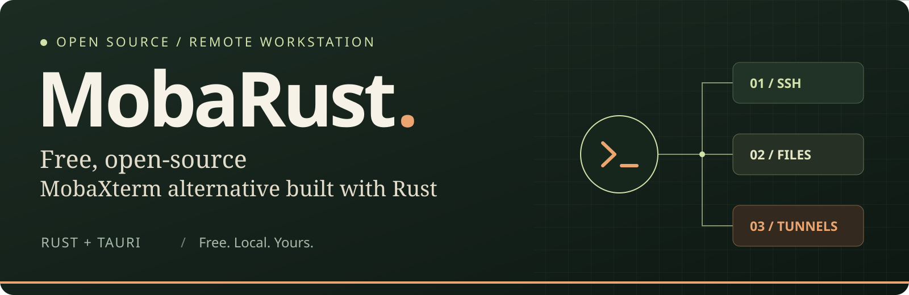
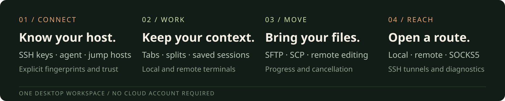
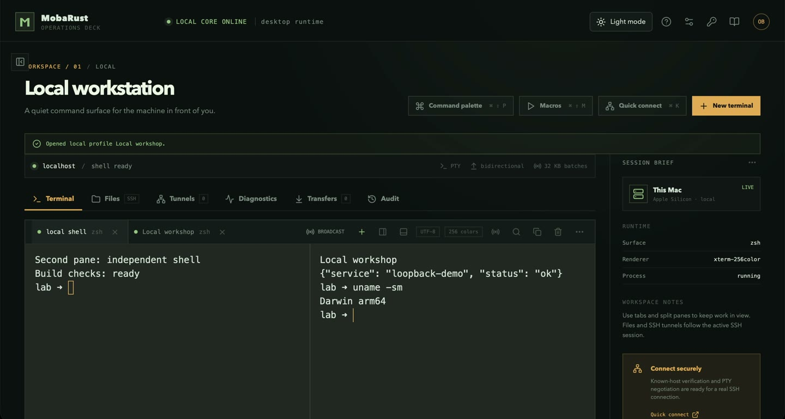
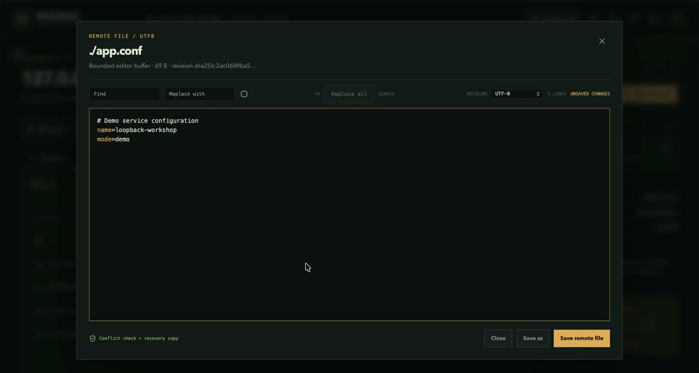

<div align="center">



**Free, open-source MobaXterm alternative built with Rust**

SSH • SFTP/SCP • terminal tabs & splits • remote editing • tunnels • reviewed automation

[](https://github.com/OthmaneBlial/MobaRust/releases/tag/v0.1.28)
[](docs/architecture.md)
[](LICENSE)

**[⬇️ Download](#download)** · **[🎬 Watch the app](#demo)** · **[🌐 Website](https://othmaneblial.github.io/MobaRust/)** · **[🧭 Roadmap](ROADMAP.md)** · **[📖 Docs](https://othmaneblial.github.io/MobaRust/docs.html)** · **[🤝 Contribute](CONTRIBUTING.md)**

</div>

<a id="demo"></a>

## 🎬 See the real app

https://github.com/user-attachments/assets/616b444e-6b8a-411e-8075-bac4f58d9d88

**From a shell to a working remote workspace.** A real macOS ARM64 application recording: independent terminal panes, an authenticated SSH session, SFTP browsing and editing, a completed file download, an HTTP request through an SSH tunnel, reusable snippets, and light/dark themes.

[▶ Watch / download the full walkthrough](https://github.com/OthmaneBlial/MobaRust/releases/download/v0.1.17/mobarust-desktop-demo.mp4) · [Recording details & chapters](docs/release/desktop-demo.md)

The server, keys, files and HTTP service are disposable loopback fixtures. The recording shows working product flows; it is not evidence of production-server or cross-platform compatibility.

## ✨ One workspace, from connection to completion



<table>
<tr>
<td width="50%" valign="top">

### 🖥️ Keep your terminals together

Local shells and SSH terminals share a workspace. Open tabs, split panes, search scrollback and keep independent tasks in view. Organize saved sessions with **folders, tags, favorites, recents and search**.



</td>
<td width="50%" valign="top">

### 📂 Work directly with remote files

Browse SFTP files, download or upload, and edit remote text without leaving the app. Transfers expose **progress and cancellation**; the editor checks for remote changes before saving.



</td>
</tr>
<tr>
<td width="50%" valign="top">

### 🔐 Make trust explicit

Connect with passwords, keys, encrypted keys or an SSH agent. Verify unknown host fingerprints, import an OpenSSH config deliberately, and use **jump hosts** to reach another network. Saved profiles hold credential references.

</td>
<td width="50%" valign="top">

### 🌐 Reach the services you need

Create **local or remote forwards and SOCKS5 proxies** with explicit bind addresses. Inspect tunnel state and byte counts; stop a listener when you're done. Network diagnostics and SSH monitoring are available on demand.

</td>
</tr>
<tr>
<td width="50%" valign="top">

### 🧩 Review before you automate

Save snippets with variables and a rendered preview. Review macros before running them. Broadcast input uses selected targets and an emergency disable, so remote execution stays deliberate.

</td>
<td width="50%" valign="top">

### 🌗 Make it your workspace

Switch light/dark themes, adjust terminal fonts and shortcuts, and keep settings locally. **No cloud account required.** Telnet and serial are also available, with their unencrypted transport boundaries made explicit.

</td>
</tr>
</table>

<a id="download"></a>

## ⬇️ Pick your platform

| Platform | Download | Available version |
| --- | --- | --- |
| 🍎 **macOS · Apple Silicon** | [ARM64 DMG](https://github.com/OthmaneBlial/MobaRust/releases/download/v0.1.28/MobaRust-0.1.28-macos-arm64.dmg) | **0.1.28** |
| 🍎 **macOS · Intel** | [x64 DMG](https://github.com/OthmaneBlial/MobaRust/releases/download/v0.1.28/MobaRust-0.1.28-macos-x64.dmg) | **0.1.28** |
| 🪟 **Windows · x64** | [Installer](https://github.com/OthmaneBlial/MobaRust/releases/download/v0.1.12/MobaRust-0.1.12-windows-x64.exe) | 0.1.12 |
| 🐧 **Ubuntu / Debian · x64** | [DEB](https://github.com/OthmaneBlial/MobaRust/releases/download/v0.1.12/MobaRust-0.1.12-linux-x64.deb) | 0.1.12 |
| 🐧 **Other Linux · x64** | [AppImage](https://github.com/OthmaneBlial/MobaRust/releases/download/v0.1.12/MobaRust-0.1.12-linux-x64.AppImage) | 0.1.12 |

**Preview distribution:** no publisher signing; macOS is ad hoc signed and not notarized. Windows/Linux installers are older and do not include the latest `main` changes. RDP is excluded from normal installers.

[📝 Mac release notes & SHA-256 files](https://github.com/OthmaneBlial/MobaRust/releases/tag/v0.1.28) · [Windows/Linux release files](https://github.com/OthmaneBlial/MobaRust/releases/tag/v0.1.12) · [Installation help](docs/release/preview-notes.md)

On Mac, move MobaRust to Applications. On Debian/Ubuntu, use `sudo apt install ./MobaRust-0.1.12-linux-x64.deb`. AppImage prerequisites vary by distribution. Checksums verify downloaded bytes; they do not establish publisher identity.

## 🚀 What's new — 0.1.28

- **Readable startup reviews:** long commands scroll with the keyboard while the destination, reconnect warning and Cancel/Continue controls stay visible.
- **Clearer SSH recovery:** stalled startup input has its own timeout message, including advice to check the remote session before reconnecting. Commands and credentials stay out of the error.
- **Native release check:** the ARM64 installer copy passed review scrolling, Escape before connection, the exact timeout message with no failed SSH tab, and normal Quit cleanup.
- **Locally checked release:** the complete suite passed, including 108 desktop tests, 25 OpenSSH cases, 22 boundary checks and 15 editor/transfer fault cases. Both Mac packages passed mounted layout, architecture, signature and CLI checks.

All four published assets were downloaded anonymously and matched the verified local bytes. Windows/Linux downloads remain v0.1.12; broader native acceptance remains pending. The walkthrough above was recorded on v0.1.17. [Release checks and limits](docs/release/v0.1.28.md).

## 🧭 Progress and next steps

**Updated 2026-10-03.** The roadmap has **57 of 76 checked items (75%)**. This is checklist completion, not production readiness: implementation, tests, downloadable binaries and hardware evidence are separate milestones.

| Area | Verified so far | Next acceptance gate |
| --- | --- | --- |
| ✅ **SSH reliability** | OpenSSH lab covers keys, jumps, agent, IPv6 and recovery. Earlier Mac authentication/reconnect receipts remain available. The v0.1.28 ARM64 copy passed long startup review, Escape before connection, the specific timeout message and normal local-PTY Quit. [Receipts](docs/testing/ssh-lab.md) · [v0.1.28 check](docs/testing/ssh-reconnect.md#v0128-arm64-release-copy-startup-timeout--2026-10-03). | Release-copy successful startup/output ordering, queued expiry/overflow, prompt/backpressure/resize acceptance, Windows/Linux, OpenSSH password/PAM and sustained workloads. |
| ✅ **Native workflow demo** | macOS ARM64 terminals, SSH, remote edit/save, file download and local tunnel. | Wider keyboard, failure-recovery and GUI coverage across all three OSes. |
| ✅ **Editor recovery** | Mac candidate passed conflict/reopen recovery and both Save as policies. The v0.1.26 ARM64 copy passed encoding Save/new Save as; the v0.1.27 copy passed explicit legacy Open/Save/reopen and UTF-8 conversion, with exact bytes/modes and normal-Quit cleanup. [Receipts](docs/testing/native-workflow.md). | Windows/Linux, saved-with-warning focus and uncertain promotion recovery. |
| ✅ **Quality baseline** | One complete green Ubuntu/macOS/Windows run on source `ac70e39`; local checks continue. | New repeated Windows startups and Linux zsh/fish runtime evidence. **GitHub CI is disabled by request.** |
| 🟡 **Native dialogues** | Mac lab verified file policies, reconnect-safe approvals, settings imports and visible error focus. Included in the v0.1.25 Mac preview. | Broader collision/recovery checks and native Windows/Linux acceptance. [Evidence](docs/testing/text-input-dialogs.md). |
| 🟡 **Distribution** | Mac ARM64/x64 0.1.28 previews; Windows/Linux 0.1.12 downloads. | Align versions, clean install/uninstall, signing and notarization. |
| 🧪 **RDP / VNC / X11 / serial** | Isolated helpers and controlled fixtures exist. | Real servers, physical adapters and platform interoperability. RDP security gates remain open. |

**Next priorities:** native platform evidence → SSH recovery/authentication coverage → aligned, trusted installers.

[📍 Detailed roadmap & completion criteria](ROADMAP.md) · [Platform evidence](docs/testing/hardware-interoperability.md) · [SSH lab](docs/testing/ssh-lab.md) · [Benchmark receipt](benchmarks/2026-10-02-local.md)

## 🛡️ Keep trust and data local

Rust owns protocols, processes, saved credentials and persistence. Unknown SSH host keys are not silently accepted. Multiline paste and remote execution have explicit review boundaries. VNC TCP and Telnet are unencrypted; experimental support is documented separately.

**Local test safety:** protocol fixtures listen only on `127.0.0.1` or `::1`, with disposable data and generated credentials. They do not enable Remote Login, change firewall/router rules or expose a home-network port. Native checks use an isolated app copy; owned test processes are stopped afterwards. [Testing boundaries](docs/security/safe-testing.md).

[Threat model](docs/security/threat-model.md) · [Dependency audit](docs/security/dependency-audit.md) · [Private vulnerability reporting](SECURITY.md)

<details>
<summary><strong>🛠️ Build and contribute</strong></summary>

Use Rust stable **1.90+**, Node.js **22**, pnpm **10**, and the [native Tauri prerequisites](CONTRIBUTING.md).

```bash
git clone https://github.com/OthmaneBlial/MobaRust.git
cd MobaRust
pnpm install --dir apps/desktop --frozen-lockfile
cargo xtask check
pnpm --dir apps/desktop tauri dev
```

```bash
cargo xtask test-ssh    # Disposable OpenSSH lab on Unix
cargo xtask check-rust  # Native workspace tests and Clippy
```

The full check covers frontend, Rust, isolated protocol helpers, package layouts and fuzz compilation. Fixtures use disposable state and generated credentials.

[Contributing](CONTRIBUTING.md) · [Architecture](docs/architecture.md) · [Safe testing](docs/security/safe-testing.md) · [Benchmarks](benchmarks/README.md)

</details>

<div align="center">

**Build your next remote workspace with us.**

[Report a bug](https://github.com/OthmaneBlial/MobaRust/issues/new/choose) · [Explore the roadmap](ROADMAP.md) · [Star MobaRust ⭐](https://github.com/OthmaneBlial/MobaRust/stargazers)

Independent project; not affiliated with Mobatek or MobaXterm. Licensed under [Apache-2.0](LICENSE).

</div>
