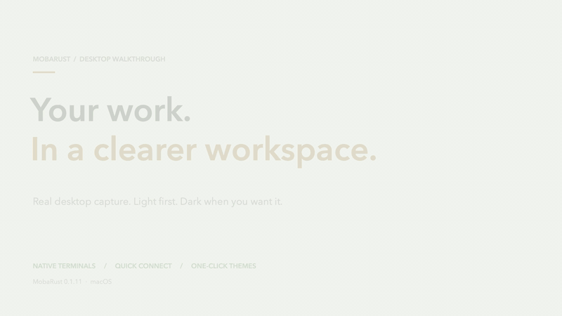

# MobaRust

### Keep the remote workday in one native workspace.

Open SSH sessions, move files over SFTP/SCP, run local terminals, and manage tunnels alongside each connection. MobaRust is a free, open-source Rust and Tauri desktop app for developers, sysadmins, DevOps teams, and homelabs.

[](https://github.com/OthmaneBlial/MobaRust/actions/workflows/quality.yml) [](LICENSE) [](https://github.com/OthmaneBlial/MobaRust/releases)

[**Download v0.1.9 preview**](https://github.com/OthmaneBlial/MobaRust/releases/tag/v0.1.9) · [Watch the real desktop demo](https://othmaneblial.github.io/MobaRust/#demo) · [Read the docs](https://othmaneblial.github.io/MobaRust/docs.html) · [Roadmap](ROADMAP.md)

MobaRust is an independent MobaXterm alternative, not a feature-for-feature clone. SSH and SFTP are the focus; experimental protocols and platform gaps are stated plainly. No cloud account required. MobaRust is not affiliated with Mobatek.

<p align="center">
  <a href="https://othmaneblial.github.io/MobaRust/#demo"></a>
</p>

The 62-second capture was recorded in MobaRust 0.1.1 on macOS with an isolated demo profile and a loopback API. Example SSH details are not used to connect. [Watch the full-resolution video with chapters and captions](https://othmaneblial.github.io/MobaRust/#demo).

## Get the desktop preview

The v0.1.9 preview provides native installers for Windows x64, macOS Apple Silicon and Intel, and Linux x64. No Rust, Node.js, or source checkout needed.

| Platform | Installer | Install |
| --- | --- | --- |
| Windows x64 | [.exe installer](https://github.com/OthmaneBlial/MobaRust/releases/download/v0.1.9/MobaRust-0.1.9-windows-x64.exe) | Run setup. WebView2 is installed if needed. |
| macOS Apple Silicon | [.dmg](https://github.com/OthmaneBlial/MobaRust/releases/download/v0.1.9/MobaRust-0.1.9-macos-arm64.dmg) | Open the image and move MobaRust to Applications. |
| macOS Intel | [.dmg](https://github.com/OthmaneBlial/MobaRust/releases/download/v0.1.9/MobaRust-0.1.9-macos-x64.dmg) | Open the image and move MobaRust to Applications. |
| Ubuntu / Debian x64 | [.deb](https://github.com/OthmaneBlial/MobaRust/releases/download/v0.1.9/MobaRust-0.1.9-linux-x64.deb) | sudo apt install ./MobaRust-0.1.9-linux-x64.deb |
| Other Linux x64 | [AppImage](https://github.com/OthmaneBlial/MobaRust/releases/download/v0.1.9/MobaRust-0.1.9-linux-x64.AppImage) | Make executable and open. WebKitGTK 4.1 and FUSE may be required. |

This is an **unsigned preview**. Windows may show SmartScreen. macOS may block first launch because the app is not Developer ID signed or notarized; see [preview installation notes](docs/release/preview-notes.md). Checksums detect damaged downloads; they do not prove publisher identity.

Use the releases page for per-platform SHA-256 files and checksum commands. Download installers there, not GitHub's autogenerated source archives.

## What you can do

| Workflow | MobaRust today |
| --- | --- |
| **Connect** | SSH with host-key verification, agent/password/key-reference auth, PTY resize, cancellation, keepalives, and bounded reconnect. |
| **Work with files** | SFTP browser, SCP compatibility, streaming and recursive transfers, progress, cancellation, explicit overwrite, and permission preservation. |
| **Keep context** | Saved sessions, folders, tags, favorites, recents, fast search, OpenSSH config import, and secret-free profile export. |
| **Operate safely** | Local terminals, split panes, tunnels, SOCKS5, reviewed snippets, cancellable macros, explicit multi-exec targets, diagnostics, and optional monitoring. |
| **Use legacy links** | Telnet is labeled unencrypted. Serial connection settings, refresh, and device-loss handling are available; hardware coverage remains open. |

The app is local-first: create local sessions without a cloud account. React renders the workspace; Rust owns networking, PTYs, filesystem operations, persistence, process lifecycle, cancellation, and credential access behind typed Tauri commands.

### What's new in v0.1.9

- X11 error details are sanitized and bounded before they reach the terminal, preventing control sequences from altering terminal output.

See the complete [v0.1.9 preview notes](docs/release/preview-notes.md) and [current release evidence](https://github.com/OthmaneBlial/MobaRust/releases/tag/v0.1.9).

## Built around clear boundaries

- SSH host verification stays explicit; unknown hosts are not silently trusted.
- Session profiles store credential references, not password or private-key contents.
- Secrets are resolved inside native code and excluded from ordinary logs and process arguments.
- Multiline terminal paste is confirmed before it can reach a shell.
- Broadcast actions require explicit targets and keep a visible stop path.
- Network work uses operation-specific bounds, cancellation, and cleanup.
- Tests use disposable state and loopback fixtures; they do not read personal SSH files or contact real hosts.

Read the [threat model](docs/security/threat-model.md) and [safe testing policy](docs/security/safe-testing.md).

## What is still experimental

RDP and VNC remain experimental. The RDP helper is excluded from installers. VNC remote TCP is unencrypted and requires explicit opt-in and confirmation. Real-world interoperability and Windows/Linux hardware evidence remain open. The preview installers are unsigned; clean-install and production-signing checks are not complete.

The project does not claim to replace every MobaXterm feature. See the [roadmap](ROADMAP.md) and [platform evidence matrix](docs/testing/hardware-interoperability.md) for current gaps.

## Build from source

### Requirements

- Rust stable (1.88 or newer)
- Node.js 22 and pnpm
- Tauri prerequisites for your operating system

```bash
git clone https://github.com/OthmaneBlial/MobaRust.git
cd MobaRust
pnpm install --dir apps/desktop
cargo xtask check
cargo tauri dev --manifest-path apps/desktop/src-tauri/Cargo.toml
```

The local checks use isolated home directories, disposable fixtures, and loopback networking. They do not need your personal SSH files, Keychain, GitHub keys, SSH agent, real hosts, or attached hardware.

Useful focused checks:

```bash
cargo xtask package-check
cargo xtask portable-check
cargo xtask package-layout-check
cargo xtask license-check
cargo xtask pre-push-check
```

## Contribute

Report reproducible issues with your OS, architecture, and steps. Never attach credentials, private keys, host inventories, or unredacted connection logs. Focused protocol fixtures, platform evidence, documentation, and code contributions are welcome.

MobaRust is licensed under the [Apache License 2.0](LICENSE).
